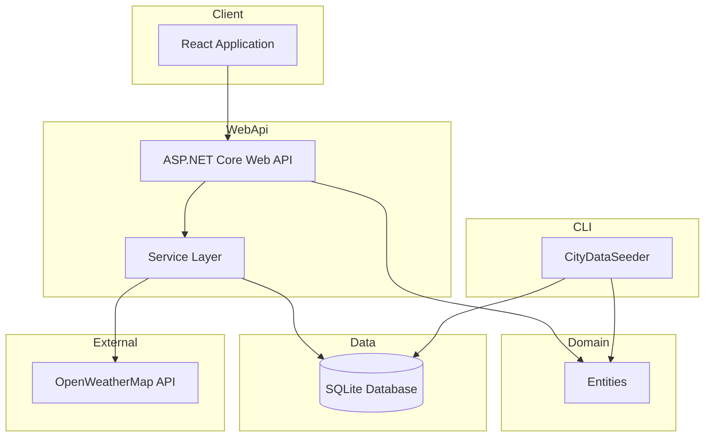
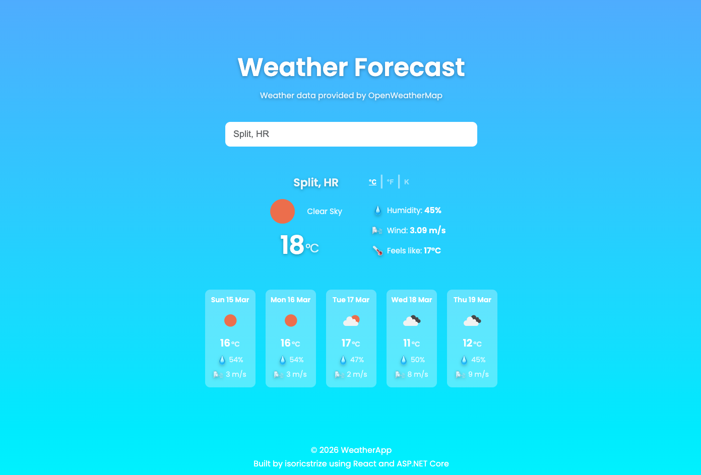

# WeatherApp

Full-stack weather application using React, ASP.NET Core Web API and SQLite.
The application allows users to view current weather and 5-day forecasts for cities stored in the database.

<p align="center">
  
  
  
  
  
  
</p>

## Technologies Used

- **.NET 9 / ASP.NET Core Web API** — Backend framework used to build RESTful APIs.

- **React 19** — Frontend library used to build the user interface.

- **SQLite** — Database used to store city data.

- **GeoNames Dataset** — Source of city data imported via CLI tool ([GeoNames](https://www.geonames.org/)).

- **OpenWeatherMap API** — External weather data provider ([OpenWeatherMap API](https://openweathermap.org/api)).

- **Scalar** — Interactive API documentation & testing.

## Key Features

- CLI tool for importing and seeding GeoNames city data

- Integration with external weather API with mapping to DTOs

- In-memory caching to reduce external API calls

- Service layer used to separate business logic from controllers

- RESTful API design with endpoints for cities, weather, and forecasts

- Global exception handling middleware for consistent API error responses

- API documentation with Scalar for easy testing

- Unit tests for CLI parsing logic and Web API service layer using NUnit

- Frontend React interface for searching cities, viewing current weather and 5-day forecasts

## Architecture

Project summaries:

- **CLI Project** — Imports GeoNames city data into the SQLite database. This project is used for seeding city data.

- **Domain** — Contains core entities shared across the solution.

- **Web API** — ASP.NET Core Web API that:
  - Serves weather data for cities stored in the database
  - Uses a service layer to separate business logic from controllers
  - Retrieves current weather and forecast data from an external weather API
  - Maps external API responses to clean DTOs
  - Implements in-memory caching to reduce external API calls
  - Provides API documentation using Scalar

- **Client** — React application that interacts the Web API and:
  - Allows users to search for cities
  - Displays current weather conditions
  - Shows a 5-day forecast
  - Supports temperature unit conversion

Diagram:



## WeatherApp Preview



## Run Locally

### CLI

The project comes with the `cities1000.txt` file for city data.  
Run CityDataSeeder to populate the database:

```bash
cd WeatherApp.CityDataSeeder.Cli
dotnet run
```

**Note:** If you want the latest city data, you can download it from here: [GeoNames](https://download.geonames.org/export/dump/)

### Backend

```bash
cd WeatherApp.WebApi
dotnet restore
dotnet run
```

**OpenWeatherMap API**: The project requires an API key, which is stored using .NET Secret Manager. You can get your own API key here: [OpenWeatherMap API Keys](https://openweathermap.org/api).
Then add it to the project:

```bash
dotnet user-secrets init
dotnet user-secrets set "OpenWeather:ApiKey" "your-api-key"
```

### Frontend

```bash
cd WeatherApp.Client
npm install
npm run dev
```

**Note:** Set the correct VITE_API_BASE_URL in .env file and make sure that WebAPI allows requests from your frontend localhost (check the Program.cs file).
